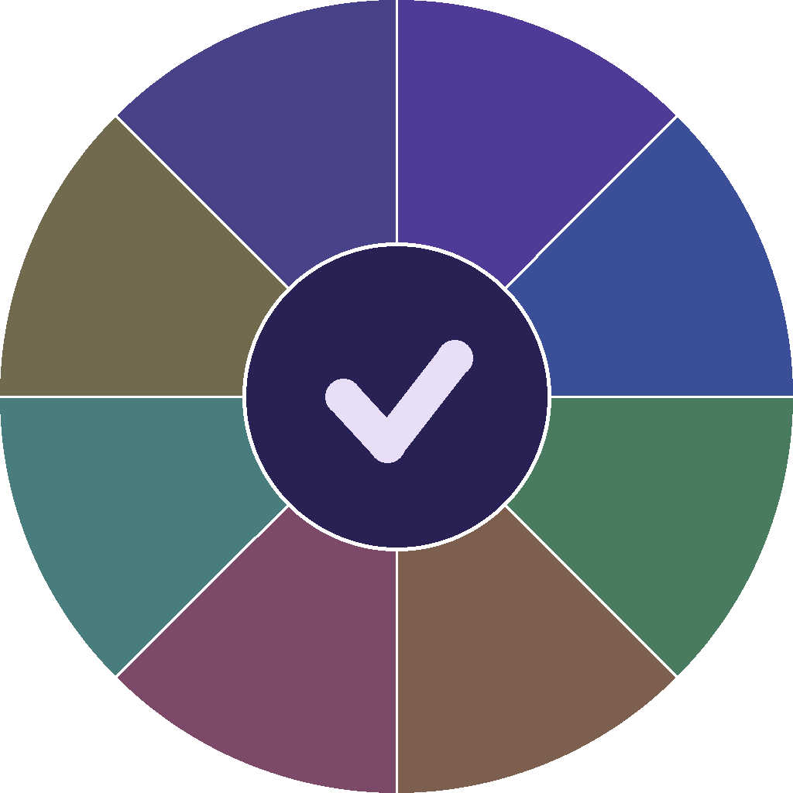

<p align="center">
  
</p>

<h1 align="center">Task Roulette</h1>

<p align="center">A task manager that helps you stop overthinking and start doing. Organize tasks into flexible groups, let the app pick what to work on next, and track your daily progress — all designed to reduce decision fatigue.</p>

> **Note:** This app was vibe-coded — planned and ideated by a human, implemented with AI assistance.

## Quick Start

**Prerequisites:** [Flutter SDK and Linux dependencies](#prerequisites) must be installed first.

```bash
flutter pub get
./dev.sh
flutter test
```

## Features

- **Flexible task groups** — tasks can live under multiple groups, so you organize things the way you think
- **Today's 5** — a daily focus list of 5 tasks, picked by weighted random to surface what matters
- **Random pick** — can't decide what to do? Let the app choose for you, with "Go Deeper" for drilling into subtasks
- **Start working / Done today** — track what you're actively working on and what you finished today
- **Priority & difficulty** — tag tasks to influence how often they get picked
- **Quick task & brain dump** — rapidly capture ideas without worrying about where they go
- **Search** — find any task instantly from anywhere in the app
- **Soft dependencies** — mark tasks as "do after..." to gently guide your order without hard blocking
- **Cloud sync** — optional Google Sign-In to sync tasks across devices via Firestore
- **Export / import** — back up your data anytime, restore on any device
- **Dark mode** — easy on the eyes, with colorful task cards
- **Supported platforms:** Android

## Setup

### Prerequisites

1. **Flutter SDK**
   ```bash
   git clone --depth 1 --branch stable https://github.com/flutter/flutter.git ~/flutter
   echo 'export PATH="$HOME/flutter/bin:$PATH"' >> ~/.bashrc
   # If you use zsh, replace ~/.bashrc with ~/.zshrc in both lines.
   source ~/.bashrc
   ```

2. **Linux desktop dependencies** (Ubuntu/Debian)
   ```bash
   sudo apt install -y clang ninja-build lld libsqlite3-dev libsecret-1-dev inotify-tools
   ```

3. **Android build dependencies** (optional, for APK builds)
   ```bash
   sudo apt install -y openjdk-17-jdk lib32stdc++6 lib32z1
   ```
   Then install the Android SDK command-line tools from https://developer.android.com/studio (under "Command line tools only") and set up:
   ```bash
   mkdir -p ~/Android/Sdk/cmdline-tools
   # Extract downloaded zip, move contents to ~/Android/Sdk/cmdline-tools/latest/
   export ANDROID_HOME=$HOME/Android/Sdk
   export PATH=$ANDROID_HOME/cmdline-tools/latest/bin:$ANDROID_HOME/platform-tools:$PATH
   # build-tools;28.0.3 is kept for compatibility with older Android tooling that may still reference it.
   sdkmanager "platform-tools" "platforms;android-36" "build-tools;35.0.0" "build-tools;28.0.3"
   flutter config --android-sdk $HOME/Android/Sdk
   flutter doctor --android-licenses
   ```

### Cloud Sync Setup (Optional)

Cloud sync lets you keep tasks in sync across your phone and desktop via Google Sign-In + Firestore. It's fully optional — the app works entirely offline without it.

#### 1. Create a Firebase project

- Go to [Firebase Console](https://console.firebase.google.com) → **Add project**
- Disable Google Analytics (not needed) → Create

#### 2. Enable Google Sign-In

- In the left sidebar: **Build** → **Authentication** → **Get started**
- **Sign-in method** tab → **Google** → Enable
- Set a support email → Save

#### 3. Create Firestore Database

- In the left sidebar: **Build** → **Firestore Database** → **Create database**
- Pick production mode and a region close to you

#### 4. Add Android app

- **Project Overview** → **Add app** → **Android**
- Package name: `com.taskroulette.task_roulette`
- Download `google-services.json` → place in `android/app/`
- Add your SHA-1 fingerprint:
  ```bash
  keytool -list -v -keystore android/upload-keystore.jks -alias upload
  ```
  When prompted for the keystore password, use the one from `android/key.properties` (`storePassword` field).
  Copy the SHA-1 from the output → paste under **Project settings → Your apps → Android → SHA certificate fingerprints → Add fingerprint**

#### 5. Create Desktop OAuth Client (for Linux)

- Go to [Google Cloud Console → Credentials](https://console.cloud.google.com/apis/credentials) (same project)
- **Create Credentials** → **OAuth client ID** → Application type: **Desktop app**
- **Important:** Note down the **Client ID** and **Client Secret** immediately — the secret is only shown once at creation time.

#### 6. Set Firestore Security Rules

- **Firestore Database** → **Rules** → replace with:
  ```
  rules_version = '2';
  service cloud.firestore {
    match /databases/{database}/documents {
      match /users/{userId}/{document=**} {
        allow read, write: if request.auth != null && request.auth.uid == userId;
      }
    }
  }
  ```
- Publish

#### 7. Create `.env` file

Create a `.env` file in the project root (it's gitignored):

```
FIREBASE_API_KEY=<your Web API Key from Firebase Project settings>
FIREBASE_PROJECT_ID=<your Project ID>
GOOGLE_DESKTOP_CLIENT_ID=<your Desktop OAuth Client ID>
GOOGLE_DESKTOP_CLIENT_SECRET=<your Desktop OAuth Client Secret>
```

The API key and project ID are in **Firebase Console → Project settings → General**. The desktop client ID/secret are from step 5.

`./dev.sh` automatically reads `.env` and passes the values as `--dart-define` flags. For Android builds, pass them manually:

```bash
flutter build apk --debug \
  --dart-define=FIREBASE_API_KEY=... \
  --dart-define=FIREBASE_PROJECT_ID=...
```

(Android uses `google-services.json` for Google Sign-In, so the desktop client ID/secret are not needed for APK builds.)

### Install dependencies (first time only)

```bash
flutter pub get
```

### Run

```bash
./dev.sh
```

This starts the app and watches `lib/` for `.dart` file changes, triggering hot reload automatically — no need to press anything. If a `.env` file exists, Firebase config is passed automatically.

To run without auto-reload:

```bash
flutter run -d linux
```

Then press `r` for hot reload or `R` for hot restart manually.

### Build debug APK (Android)

```bash
flutter build apk --debug
```

Output: `build/app/outputs/flutter-apk/app-debug.apk` — transfer to your phone and install.

> **Warning:** Debug and release APKs have different signing keys. Installing a debug APK over a release build (or vice versa) will **uninstall the existing app and wipe its data**. To test a debug build safely, back up the database first using the app's export feature, or use `adb` to copy it:
> ```bash
> adb exec-out run-as com.taskroulette.task_roulette cat databases/task_roulette.db > /tmp/task_roulette_backup.db
> ```

### Test on phone via ADB

To sideload a debug APK over ADB without `flutter run` (which auto-uninstalls on signature mismatch):

```bash
flutter build apk --debug
adb install -r build/app/outputs/flutter-apk/app-debug.apk   # -r = replace if same signature
adb logcat -s flutter                                          # view Flutter debug output
```

### Test

```bash
flutter test
```

Run this before committing to catch regressions. Tests cover the Task model, database operations (using sqflite_ffi in-memory), and widget rendering.

To run a specific test file:

```bash
flutter test test/models/task_test.dart
```

## Project Structure

```
lib/
├── main.dart                 # App entry, theme, Provider setup
├── models/
│   ├── task.dart             # Task model
│   └── task_relationship.dart # Parent-child relationship model
├── data/
│   └── database_helper.dart  # SQLite database operations
├── providers/
│   ├── task_provider.dart    # State management (ChangeNotifier)
│   ├── auth_provider.dart    # Google auth state
│   └── theme_provider.dart   # Theme mode state
├── services/
│   ├── auth_service.dart     # Google Sign-In + Firebase Auth REST API
│   ├── firestore_service.dart # Firestore REST API for cloud sync
│   └── sync_service.dart     # Sync orchestration (push/pull/migration)
├── screens/
│   └── task_list_screen.dart # Main screen
└── widgets/
    ├── task_card.dart        # Task grid card (tap, long-press for actions)
    ├── task_picker_dialog.dart # Search/filter dialog for linking tasks
    ├── leaf_task_detail.dart  # Leaf task detail view with Done action
    ├── empty_state.dart      # Empty state placeholder
    ├── add_task_dialog.dart  # New task dialog
    ├── profile_icon.dart     # Google profile + sync status icon
    └── random_result_dialog.dart # Random pick result

test/
├── models/
│   └── task_test.dart              # Task model unit tests
├── data/
│   └── database_helper_test.dart   # DB operations tests
├── providers/
│   └── task_provider_test.dart     # Provider state management tests
└── widgets/
    ├── leaf_task_detail_test.dart   # Leaf detail widget tests
    └── task_card_test.dart         # Task card widget tests
```

## Troubleshooting

### Setting up adb

1. **Install adb** (Ubuntu/Debian):
   ```bash
   sudo apt install -y adb
   ```

2. **Enable wireless debugging** on your Android phone:
   - Go to **Settings > System > Developer options** (tap Build number 7 times to unlock)
   - Enable **Wireless debugging**
   - Tap **Wireless debugging** to open its settings, then tap **Pair device with pairing code**
   - On your computer:
     ```bash
     adb pair <ip>:<pairing-port>   # enter the pairing code when prompted
     adb connect <ip>:<port>        # use the port shown on the Wireless debugging screen (not the pairing port)
     ```

3. **Verify connection:**
   ```bash
   adb devices   # should list your device
   ```

### ANR / freezes on Android

If the app becomes unresponsive on Android, capture logs:

```bash
# Clear old logs, then capture everything to a file
adb logcat -c && adb logcat > /tmp/crash_log.txt
# Now reproduce the freeze on the phone, then Ctrl+C to stop capture

# Or filter for ANR-specific messages only
adb logcat -s ActivityManager:E ANRManager:E

# Pull ANR traces after the freeze
adb pull /data/anr/traces.txt
```

### Symbolicating release crash stacks

Release builds are obfuscated. Download `debug-symbols.zip` from the [GitHub release](https://github.com/sohamM97/task-roulette/releases), then:

```bash
unzip debug-symbols.zip -d symbols/
flutter symbolize -i stacktrace.txt -d symbols/
```

See [docs/PERFORMANCE.md](docs/PERFORMANCE.md) for details on database optimizations and performance considerations.
